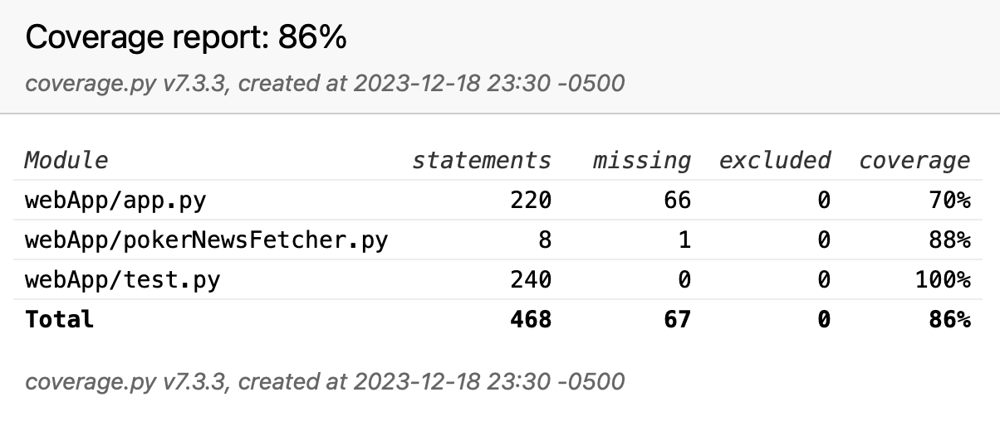

[](https://github.com/software-students-fall2023/5-final-project-lastteam/actions/workflows/web-app.yml)

# Poker Profit Tracker Pro

Build a containerized poker hand analysis app with CI/CD pipelines. See [instructions](./instructions.md) for details.

## [Live Demo](http://159.203.68.77:5001/)

Click on the above text to view the deployed demo!

### [DockerHub Image](https://hub.docker.com/repository/docker/wwxihan/pocker-app/general)

## Team Members:

- [Merlin Li](https://github.com/wwxihan2)
- [Steven Li](https://github.com/stevenkhl446)
- [Zander Chen](https://github.com/ccczy-czy)

## Description:

Tracking poker profits and losses can be a tedious task, especially when trying to maintain data integrity and accuracy over an extended period. Poker Profit Tracker aims to solve this problem by providing a dedicated web application that allows poker players to systematically record, track, and analyze their gaming sessions. PPTp will facilitate users to register, login, and manage their poker session data seamlessly, with an easy-to-use and intuitive interface that focuses on user experience and data accuracy along with integration of other external APIs.

## Data Model

The application will primarily involve the management of Users and Poker Sessions, with a relation linking users to multiple sessions.

Users can have multiple poker sessions (via references).
Each session will hold detailed information about the gaming activity.

An Example User:

{
username: "poker_pro123",
hash: // a password hash,
sessions: // an array of references to Poker Session documents
}

```

An Example Poker Session:

{
  user: // a reference to a User object,
  buyIn: Number, //buy in amount
  date: Date, //date
  cashOut: Number, //cash out amount
  profit: Number, //cash out -buy in
  highlights: String,//not needed
  location: String //location of the session
}

```

Poker Main(home)
Menu: Sessions
view sessions(list of all sessions created)
create a session(to create a session)
Search
Search session by either (date, buyin, location, or profit/loss)
User Settings
change Password
change Username
Delete Account(this will delete the account from the database)
log out
log out from Poker Profit Tracker Pro

Links to all

# User Stories or Use Cases

1. As a non-registered user, I can register a new account with the site.
2. As a user, I can log in to the site.
3. As a user, I can create or delete a poker session.
4. As a user, I can view a summary of all my poker sessions in graphs.
5. As a user, I can view or create detailed information of each poker session.
6. As a user, I can change user informations.
7. As a user, I can view the latest poker news.

## Setup:

### Prerequisites:

Before you start the steps below, make sure you have the following downloaded on your system:

- [Docker](https://docs.docker.com/get-docker/)
- [Docker Compose](https://docs.docker.com/compose/install/)

### Running the Application:

1. Clone the repository:

```
git clone https://github.com/software-students-fall2023/5-final-project-lastteam.git
```

2. Navigate to the project directory:

```
cd 5-final-project-lastteam
```

3. Build docker images and run the containers:

```
docker compose up --build -d
```

4. Open the application in your browser:

```
http://localhost:5001
```

5. To stop the containers, run the command:

```
docker compose down
```

# Starter data demo

create user name and password as you wish, and create as many sessions for poker. Make sure you are logged in before using any features.

## Test Coverage

